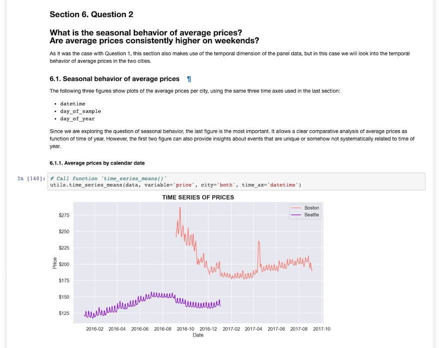

# Airbnb in Boston and Seattle

## Analysis of Availability, Pricing, and Reviews

> Example screen:



## Motivation and synopsis

This project is an exercise in quantitative-business research using public Airbnb data for the cities of [Boston](https://www.kaggle.com/airbnb/boston) and [Seattle](https://www.kaggle.com/airbnb/seattle/data). 

The main analysis in the project is an investigation of the following 3 questions:

1. What is the temporal behavior of the average availability of Airbnb homes in each city? And how do they compare to each other?
2. What is the seasonal behavior of average rates for Airbnb homes in these cities? Also, are average rates consistently higher on weekends?
3. What is the association between nightly price/rate and the quantity of reviews received by a home on Airbnb?

## Blog post on Medium 

[Airbnb in Boston and Seattle: Availability, Pricing, and Reviews](https://medium.com/@jcl/airbnb-in-boston-and-seattle-d2a6daf82b11)

## Files in the repository

* `jcl-airbnb.ipynb`:  Jupyter notebook including main code for data cleaning, analysis, and modeling; as well as comments and discussion of results. 
* `jcl-airbnb.html`:  `html` copy of the Jupyter notebook to be opened with any browser. 
* `utility_fs.py`:  Python file including the custom-built functions required for the main analysis in the Jupyter notebook. 
* `jupyter_screen.png`:  Example screen-shot of the Jupyter notebook.

## Usage example for new users

The Jupyter Project highly recommends new users to install [Anaconda](https://www.anaconda.com/distribution/); since it conveniently installs Python, the Jupyter Notebook, and other commonly used packages for scientific computing and data science.

Use the following installation steps:

1. Download Anaconda.

2. Install the version of Anaconda which you downloaded, following the instructions on the download page.

3. To run the notebook:

```
jupyter notebook jcl-airbnb.ipynb
```

## Python version

3.7.1 (default, Oct 23 2018, 14:07:42) 

## Python libraries

The Jupyter Notebook file, `jcl-airbnb.ipynb`,  requires the following Python libraries:
- sys
- numpy
- pandas
- matplotlib
- seaborn
- statsmodels.api
- utility_fs.py

The utility functions in `utility_fs.py` require the following Python libraries:
- numpy
- pandas
- calendar
- collections
- warnings
- matplotlib
- seaborn
- sklearn
- statsmodel.api

## Data for Boston and Seattle

The project relies on three analogous datasets for each city:

* **Listings**, including full descriptions and average review score 
* **Reviews**, including unique id for each reviewer and detailed comments 
* **Calendar**, including listing id and the price and availability for that day

Six (6) `csv` files in total.

## Summary of results

Below is a brief synopsis of the results of the analysis, addressing each of the business questions described at the beginning of this document.

### 1)  Temporal behavior of average availability 

Average availability does not seem to show a systematic, seasonal behavior. In fact, the average availabilities per city follow very similar (or parallel) patterns only when plotted against the **day-of-sample** — from day 1 to day 365 of each sample — as opposed to the actual date or the day of year (i.e., Jan-1 to Dec-31). Since the samples for the two cities correspond to two different time frames with respect to calendar dates, I can’t think of a good reason why the trends would match in this way, unless the behavior is entirely a product of sample selection and panel-dataset construction.

### 2)  Weekly and seasonal behavior of average Airbnb rates 

Following a noisy segment of data for Boston (first 120 days of sample), the time-series of Boston’s average rate follows the same weekly cycle as Seattle’s average rate. The association between average rate and day-of-week seems to be analogous across the two cities:
1. The lowest rates are posted for Monday, Tuesday, and Wednesday.
2. Slightly higher rates are posted for Thursdays and Sundays.
3. Rates increase and peak for the weekend evenings, Fridays and Saturdays.

The visualizations that show average rates in a calendar year suggest the following working hypotheses: 
1. Average rates seem to be increasing independently of season. I would guess that average rates in this two cities were increasing year over year.
2. The seasonal behavior of rates is analogous in Boston and Seattle, with average price peaking in the early Summer months and bottoming out in late Winter.
3. The spike in the Boston average rate that happens in September of 2016 is not a product of real conditions in the city. This trend of high and noisy rates is due to a smaller sample of available listings in Boston during that time frame. 
4. The highly noticeable spike in the Boston average rate that happens in April of 2017 is most likely a product of a real event that affected the market conditions in the city: the 2017 Boston Marathon.

### 3)  Association between rates and quantity of guest reviews 

The association between rates and the quantity of reviews is difficult to investigate exclusively through visualizations. Thus, the analysis relies on a comparison of means using multivariate linear regressions.

* Estimating a naive-pooled-model without covariates/controls suggests that, on average, every additional guest review is associated with a decrease in rates of 0.17%. This is counterintuitive if one believes that reviews tend to be positive and associated with good-quality AirBnB homes; which in turn should provide leverage for hosts to ask for higher rates for their homes.

* Another specification of the model, with controls for home size, location, and time trends, produces an estimate of -0.0008: on average, every additional guest review is associated with a decrease in rates of 0.08%.

* The estimate coming from the last specification of the model indicates that if we control for home size, location, and time trends, having 1 or more guest reviews is associated with an average decrease in rates of 6% — that is, relative to the average rate of homes with no reviews. 

Once again, these are counterintuitive findings to me, if one believes that being reviewed provides the host leverage to increase its rate. On the other hand, if the saliency of bad experiences on AirBnB drive guests to disproportionately post bad reviews, then our measurement would be consistent with that mechanism.

Finally, an alternative explanation would be that there are selection bias problems in the sample with respect to guest reviews. If there is some underlying mechanism by which the reviewed listings are systematically different from the listings with zero reviews, then the average difference in price would be impossible to predict without a conceptual understanding of said systematic differences.

## Acknowledgments

* [Josh Bernhard](https://medium.com/@josh_2774), [Robert Chang](https://medium.com/@rchang) for inspiration and examples.
* [Airbnb Open Data](https://www.kaggle.com/airbnb)
* Jupyter Documentation: [Installing Jupyter Notebook](https://jupyter.readthedocs.io/en/latest/install.html)

## Author

Juan Carlos Lopez

- jc.lopezh@gmail.com
- [GitHub](https://github.com/jclh/)
- [LinkedIn](https://www.linkedin.com/in/jclopezh/)

## Contributing

1. Fork it (https://github.com/jclh/airbnb-boston-seattle/fork)
2. Create your feature branch (git checkout -b feature/fooBar)
3. Commit your changes (git commit -am 'Add some fooBar')
4. Push to the branch (git push origin feature/fooBar)
5. Create a new Pull Request
